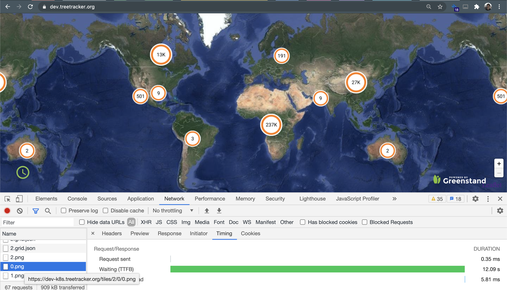
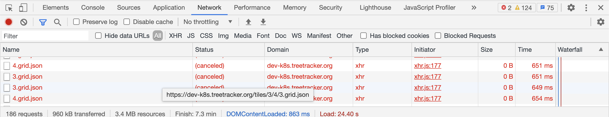
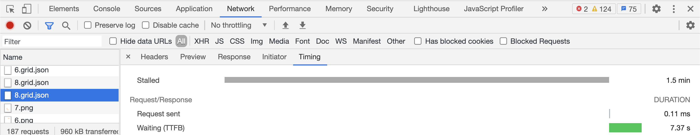

The repo for load test against the web map tile server.

---------------------

Restul report

* Case 1

```
k6> k6 run --vus 10 --duration 30s test.js

          /\      |‾‾| /‾‾/   /‾‾/
     /\  /  \     |  |/  /   /  /
    /  \/    \    |     (   /   ‾‾\
   /          \   |  |\  \ |  (‾)  |
  / __________ \  |__| \__\ \_____/ .io

  execution: local
     script: test.js
     output: -

  scenarios: (100.00%) 1 scenario, 10 max VUs, 1m0s max duration (incl. graceful stop):
           * default: 10 looping VUs for 30s (gracefulStop: 30s)


running (0m33.4s), 00/10 VUs, 80 complete and 0 interrupted iterations
default ✓ [======================================] 10 VUs  30s

     ✓ response code was 200

     checks.........................: 100.00% ✓ 80   ✗ 0
     data_received..................: 138 kB  4.1 kB/s
     data_sent......................: 7.2 kB  215 B/s
     http_req_blocked...............: avg=57.44µs min=2µs   med=6µs   max=567µs p(90)=339.1µs p(95)=446.7µs
     http_req_connecting............: avg=45.75µs min=0s    med=0s    max=480µs p(90)=293.7µs p(95)=404.54µs
     http_req_duration..............: avg=3.05s   min=1.77s med=3.07s max=5.09s p(90)=3.61s   p(95)=3.88s
       { expected_response:true }...: avg=3.05s   min=1.77s med=3.07s max=5.09s p(90)=3.61s   p(95)=3.88s
     http_req_failed................: 0.00%   ✓ 0    ✗ 80
     http_req_receiving.............: avg=76.52µs min=22µs  med=69µs  max=189µs p(90)=113µs   p(95)=147.3µs
     http_req_sending...............: avg=37.14µs min=11µs  med=27µs  max=178µs p(90)=71.8µs  p(95)=92.14µs
     http_req_tls_handshaking.......: avg=0s      min=0s    med=0s    max=0s    p(90)=0s      p(95)=0s
     http_req_waiting...............: avg=3.05s   min=1.77s med=3.07s max=5.09s p(90)=3.61s   p(95)=3.88s
     http_reqs......................: 80      2.398392/s
     iteration_duration.............: avg=4.05s   min=2.77s med=4.07s max=6.09s p(90)=4.61s   p(95)=4.89s
     iterations.....................: 80      2.398392/s
     vus............................: 3       min=3  max=10
     vus_max........................: 10      min=10 max=10
```

* Case2

```
k6> k6 run browser.js

          /\      |‾‾| /‾‾/   /‾‾/
     /\  /  \     |  |/  /   /  /
    /  \/    \    |     (   /   ‾‾\
   /          \   |  |\  \ |  (‾)  |
  / __________ \  |__| \__\ \_____/ .io

INFO[0000] url to request:
 http://127.0.0.1:23101/2/0/0.png
http://127.0.0.1:23101/2/0/1.png
http://127.0.0.1:23101/2/0/2.png
http://127.0.0.1:23101/2/1/0.png
http://127.0.0.1:23101/2/1/1.png
http://127.0.0.1:23101/2/1/2.png
http://127.0.0.1:23101/2/2/0.png
http://127.0.0.1:23101/2/2/1.png
http://127.0.0.1:23101/2/2/2.png
http://127.0.0.1:23101/2/3/0.png
http://127.0.0.1:23101/2/3/1.png
http://127.0.0.1:23101/2/3/2.png
http://127.0.0.1:23101/2/0/0.grid.json
http://127.0.0.1:23101/2/0/1.grid.json
http://127.0.0.1:23101/2/0/2.grid.json
http://127.0.0.1:23101/2/1/0.grid.json
http://127.0.0.1:23101/2/1/1.grid.json
http://127.0.0.1:23101/2/1/2.grid.json
http://127.0.0.1:23101/2/2/0.grid.json
http://127.0.0.1:23101/2/2/1.grid.json
http://127.0.0.1:23101/2/2/2.grid.json
http://127.0.0.1:23101/2/3/0.grid.json
http://127.0.0.1:23101/2/3/1.grid.json
http://127.0.0.1:23101/2/3/2.grid.json  source=console
  execution: local
     script: browser.js
     output: -

  scenarios: (100.00%) 1 scenario, 1 max VUs, 10m30s max duration (incl. graceful stop):
           * default: 1 iterations for each of 1 VUs (maxDuration: 10m0s, gracefulStop: 30s)

INFO[0000] url to request:
 http://127.0.0.1:23101/2/0/0.png
http://127.0.0.1:23101/2/0/1.png
http://127.0.0.1:23101/2/0/2.png
http://127.0.0.1:23101/2/1/0.png
http://127.0.0.1:23101/2/1/1.png
http://127.0.0.1:23101/2/1/2.png
http://127.0.0.1:23101/2/2/0.png
http://127.0.0.1:23101/2/2/1.png
http://127.0.0.1:23101/2/2/2.png
http://127.0.0.1:23101/2/3/0.png
http://127.0.0.1:23101/2/3/1.png
http://127.0.0.1:23101/2/3/2.png
http://127.0.0.1:23101/2/0/0.grid.json
http://127.0.0.1:23101/2/0/1.grid.json
http://127.0.0.1:23101/2/0/2.grid.json
http://127.0.0.1:23101/2/1/0.grid.json
http://127.0.0.1:23101/2/1/1.grid.json
http://127.0.0.1:23101/2/1/2.grid.json
http://127.0.0.1:23101/2/2/0.grid.json
http://127.0.0.1:23101/2/2/1.grid.json
http://127.0.0.1:23101/2/2/2.grid.json
http://127.0.0.1:23101/2/3/0.grid.json
http://127.0.0.1:23101/2/3/1.grid.json
http://127.0.0.1:23101/2/3/2.grid.json  source=console
INFO[0000] url to request:
 http://127.0.0.1:23101/2/0/0.png
http://127.0.0.1:23101/2/0/1.png
http://127.0.0.1:23101/2/0/2.png
http://127.0.0.1:23101/2/1/0.png
http://127.0.0.1:23101/2/1/1.png
http://127.0.0.1:23101/2/1/2.png
http://127.0.0.1:23101/2/2/0.png
http://127.0.0.1:23101/2/2/1.png
http://127.0.0.1:23101/2/2/2.png
http://127.0.0.1:23101/2/3/0.png
http://127.0.0.1:23101/2/3/1.png
http://127.0.0.1:23101/2/3/2.png
http://127.0.0.1:23101/2/0/0.grid.json
http://127.0.0.1:23101/2/0/1.grid.json
http://127.0.0.1:23101/2/0/2.grid.json
http://127.0.0.1:23101/2/1/0.grid.json
http://127.0.0.1:23101/2/1/1.grid.json
http://127.0.0.1:23101/2/1/2.grid.json
http://127.0.0.1:23101/2/2/0.grid.json
http://127.0.0.1:23101/2/2/1.grid.json
http://127.0.0.1:23101/2/2/2.grid.json
http://127.0.0.1:23101/2/3/0.grid.json
http://127.0.0.1:23101/2/3/1.grid.json
http://127.0.0.1:23101/2/3/2.grid.json  source=console
INFO[0017] url to request:
 http://127.0.0.1:23101/2/0/0.png
http://127.0.0.1:23101/2/0/1.png
http://127.0.0.1:23101/2/0/2.png
http://127.0.0.1:23101/2/1/0.png
http://127.0.0.1:23101/2/1/1.png
http://127.0.0.1:23101/2/1/2.png
http://127.0.0.1:23101/2/2/0.png
http://127.0.0.1:23101/2/2/1.png
http://127.0.0.1:23101/2/2/2.png
http://127.0.0.1:23101/2/3/0.png
http://127.0.0.1:23101/2/3/1.png
http://127.0.0.1:23101/2/3/2.png
http://127.0.0.1:23101/2/0/0.grid.json
http://127.0.0.1:23101/2/0/1.grid.json
http://127.0.0.1:23101/2/0/2.grid.json
http://127.0.0.1:23101/2/1/0.grid.json
http://127.0.0.1:23101/2/1/1.grid.json
http://127.0.0.1:23101/2/1/2.grid.json
http://127.0.0.1:23101/2/2/0.grid.json
http://127.0.0.1:23101/2/2/1.grid.json
http://127.0.0.1:23101/2/2/2.grid.json
http://127.0.0.1:23101/2/3/0.grid.json
http://127.0.0.1:23101/2/3/1.grid.json
http://127.0.0.1:23101/2/3/2.grid.json  source=console

running (00m16.7s), 0/1 VUs, 1 complete and 0 interrupted iterations
default ✓ [======================================] 1 VUs  00m16.7s/10m0s  1/1 iters, 1 per VU
INFO[0017] url to request:
 http://127.0.0.1:23101/2/0/0.png
http://127.0.0.1:23101/2/0/1.png
http://127.0.0.1:23101/2/0/2.png
http://127.0.0.1:23101/2/1/0.png
http://127.0.0.1:23101/2/1/1.png
http://127.0.0.1:23101/2/1/2.png
http://127.0.0.1:23101/2/2/0.png
http://127.0.0.1:23101/2/2/1.png
http://127.0.0.1:23101/2/2/2.png
http://127.0.0.1:23101/2/3/0.png
http://127.0.0.1:23101/2/3/1.png
http://127.0.0.1:23101/2/3/2.png
http://127.0.0.1:23101/2/0/0.grid.json
http://127.0.0.1:23101/2/0/1.grid.json
http://127.0.0.1:23101/2/0/2.grid.json
http://127.0.0.1:23101/2/1/0.grid.json
http://127.0.0.1:23101/2/1/1.grid.json
http://127.0.0.1:23101/2/1/2.grid.json
http://127.0.0.1:23101/2/2/0.grid.json
http://127.0.0.1:23101/2/2/1.grid.json
http://127.0.0.1:23101/2/2/2.grid.json
http://127.0.0.1:23101/2/3/0.grid.json
http://127.0.0.1:23101/2/3/1.grid.json
http://127.0.0.1:23101/2/3/2.grid.json  source=console

     ✓ response code was 200

     checks.........................: 100.00% ✓ 24  ✗ 0
     data_received..................: 76 kB   4.6 kB/s
     data_sent......................: 2.2 kB  133 B/s
     http_req_blocked...............: avg=199.83µs min=2µs      med=5µs    max=966µs  p(90)=845.2µs p(95)=864µs

     http_req_connecting............: avg=92.62µs  min=0s       med=0s     max=790µs  p(90)=314.5µs p(95)=360.19
µs
     http_req_duration..............: avg=3.87s    min=966.54ms med=3.29s  max=9.03s  p(90)=6.3s    p(95)=8.02s

       { expected_response:true }...: avg=3.87s    min=966.54ms med=3.29s  max=9.03s  p(90)=6.3s    p(95)=8.02s

     http_req_failed................: 0.00%   ✓ 0   ✗ 24
     http_req_receiving.............: avg=161.66µs min=50µs     med=95µs   max=1.6ms  p(90)=154.6µs p(95)=197.39
µs
     http_req_sending...............: avg=163.33µs min=14µs     med=22µs   max=997µs  p(90)=738.3µs p(95)=896.04
µs
     http_req_tls_handshaking.......: avg=0s       min=0s       med=0s     max=0s     p(90)=0s      p(95)=0s

     http_req_waiting...............: avg=3.87s    min=966.41ms med=3.29s  max=9.03s  p(90)=6.3s    p(95)=8.02s

     http_reqs......................: 24      1.434074/s
     iteration_duration.............: avg=16.73s   min=16.73s   med=16.73s max=16.73s p(90)=16.73s  p(95)=16.73s

     iterations.....................: 1       0.059753/s
     vus............................: 1       min=1 max=1
     vus_max........................: 1       min=1 max=1

```


* Case3 

```

k6> k6 run browser.js

          /\      |‾‾| /‾‾/   /‾‾/
     /\  /  \     |  |/  /   /  /
    /  \/    \    |     (   /   ‾‾\
   /          \   |  |\  \ |  (‾)  |
  / __________ \  |__| \__\ \_____/ .io

INFO[0000] url to request:
 http://127.0.0.1:23101/2/0/0.png
http://127.0.0.1:23101/2/0/1.png
http://127.0.0.1:23101/2/0/2.png
http://127.0.0.1:23101/2/1/0.png
http://127.0.0.1:23101/2/1/1.png
http://127.0.0.1:23101/2/1/2.png
http://127.0.0.1:23101/2/2/0.png
http://127.0.0.1:23101/2/2/1.png
http://127.0.0.1:23101/2/2/2.png
http://127.0.0.1:23101/2/3/0.png
http://127.0.0.1:23101/2/3/1.png
http://127.0.0.1:23101/2/3/2.png
http://127.0.0.1:23101/2/0/0.grid.json
http://127.0.0.1:23101/2/0/1.grid.json
http://127.0.0.1:23101/2/0/2.grid.json
http://127.0.0.1:23101/2/1/0.grid.json
http://127.0.0.1:23101/2/1/1.grid.json
http://127.0.0.1:23101/2/1/2.grid.json
http://127.0.0.1:23101/2/2/0.grid.json
http://127.0.0.1:23101/2/2/1.grid.json
http://127.0.0.1:23101/2/2/2.grid.json
http://127.0.0.1:23101/2/3/0.grid.json
http://127.0.0.1:23101/2/3/1.grid.json
http://127.0.0.1:23101/2/3/2.grid.json  source=console
  execution: local
     script: browser.js
     output: -

  scenarios: (100.00%) 1 scenario, 1 max VUs, 10m30s max duration (incl. graceful stop):
           * default: 1 iterations for each of 1 VUs (maxDuration: 10m0s, gracefulStop: 30s)

INFO[0001] url to request:
 http://127.0.0.1:23101/2/0/0.png
http://127.0.0.1:23101/2/0/1.png
http://127.0.0.1:23101/2/0/2.png
http://127.0.0.1:23101/2/1/0.png
http://127.0.0.1:23101/2/1/1.png
http://127.0.0.1:23101/2/1/2.png
http://127.0.0.1:23101/2/2/0.png
http://127.0.0.1:23101/2/2/1.png
http://127.0.0.1:23101/2/2/2.png
http://127.0.0.1:23101/2/3/0.png
http://127.0.0.1:23101/2/3/1.png
http://127.0.0.1:23101/2/3/2.png
http://127.0.0.1:23101/2/0/0.grid.json
http://127.0.0.1:23101/2/0/1.grid.json
http://127.0.0.1:23101/2/0/2.grid.json
http://127.0.0.1:23101/2/1/0.grid.json
http://127.0.0.1:23101/2/1/1.grid.json
http://127.0.0.1:23101/2/1/2.grid.json
http://127.0.0.1:23101/2/2/0.grid.json
http://127.0.0.1:23101/2/2/1.grid.json
http://127.0.0.1:23101/2/2/2.grid.json
http://127.0.0.1:23101/2/3/0.grid.json
http://127.0.0.1:23101/2/3/1.grid.json
http://127.0.0.1:23101/2/3/2.grid.json  source=console
INFO[0001] url to request:
 http://127.0.0.1:23101/2/0/0.png
http://127.0.0.1:23101/2/0/1.png
http://127.0.0.1:23101/2/0/2.png
http://127.0.0.1:23101/2/1/0.png
http://127.0.0.1:23101/2/1/1.png
http://127.0.0.1:23101/2/1/2.png
http://127.0.0.1:23101/2/2/0.png
http://127.0.0.1:23101/2/2/1.png
http://127.0.0.1:23101/2/2/2.png
http://127.0.0.1:23101/2/3/0.png
http://127.0.0.1:23101/2/3/1.png
http://127.0.0.1:23101/2/3/2.png
http://127.0.0.1:23101/2/0/0.grid.json
http://127.0.0.1:23101/2/0/1.grid.json
http://127.0.0.1:23101/2/0/2.grid.json
http://127.0.0.1:23101/2/1/0.grid.json
http://127.0.0.1:23101/2/1/1.grid.json
http://127.0.0.1:23101/2/1/2.grid.json
http://127.0.0.1:23101/2/2/0.grid.json
http://127.0.0.1:23101/2/2/1.grid.json
http://127.0.0.1:23101/2/2/2.grid.json
http://127.0.0.1:23101/2/3/0.grid.json
http://127.0.0.1:23101/2/3/1.grid.json
http://127.0.0.1:23101/2/3/2.grid.json  source=console
INFO[0011] url to request:
 http://127.0.0.1:23101/2/0/0.png
http://127.0.0.1:23101/2/0/1.png
http://127.0.0.1:23101/2/0/2.png
http://127.0.0.1:23101/2/1/0.png
http://127.0.0.1:23101/2/1/1.png
http://127.0.0.1:23101/2/1/2.png
http://127.0.0.1:23101/2/2/0.png
http://127.0.0.1:23101/2/2/1.png
http://127.0.0.1:23101/2/2/2.png
http://127.0.0.1:23101/2/3/0.png
http://127.0.0.1:23101/2/3/1.png
http://127.0.0.1:23101/2/3/2.png
http://127.0.0.1:23101/2/0/0.grid.json
http://127.0.0.1:23101/2/0/1.grid.json
http://127.0.0.1:23101/2/0/2.grid.json
http://127.0.0.1:23101/2/1/0.grid.json
http://127.0.0.1:23101/2/1/1.grid.json
http://127.0.0.1:23101/2/1/2.grid.json
http://127.0.0.1:23101/2/2/0.grid.json
http://127.0.0.1:23101/2/2/1.grid.json
http://127.0.0.1:23101/2/2/2.grid.json
http://127.0.0.1:23101/2/3/0.grid.json
http://127.0.0.1:23101/2/3/1.grid.json
http://127.0.0.1:23101/2/3/2.grid.json  source=console

running (00m11.0s), 0/1 VUs, 1 complete and 0 interrupted iterations
default ✓ [======================================] 1 VUs  00m11.0s/10m0s  1/1 iters, 1 per VU
INFO[0011] url to request:
 http://127.0.0.1:23101/2/0/0.png
http://127.0.0.1:23101/2/0/1.png
http://127.0.0.1:23101/2/0/2.png
http://127.0.0.1:23101/2/1/0.png
http://127.0.0.1:23101/2/1/1.png
http://127.0.0.1:23101/2/1/2.png
http://127.0.0.1:23101/2/2/0.png
http://127.0.0.1:23101/2/2/1.png
http://127.0.0.1:23101/2/2/2.png
http://127.0.0.1:23101/2/3/0.png
http://127.0.0.1:23101/2/3/1.png
http://127.0.0.1:23101/2/3/2.png
http://127.0.0.1:23101/2/0/0.grid.json
http://127.0.0.1:23101/2/0/1.grid.json
http://127.0.0.1:23101/2/0/2.grid.json
http://127.0.0.1:23101/2/1/0.grid.json
http://127.0.0.1:23101/2/1/1.grid.json
http://127.0.0.1:23101/2/1/2.grid.json
http://127.0.0.1:23101/2/2/0.grid.json
http://127.0.0.1:23101/2/2/1.grid.json
http://127.0.0.1:23101/2/2/2.grid.json
http://127.0.0.1:23101/2/3/0.grid.json
http://127.0.0.1:23101/2/3/1.grid.json
http://127.0.0.1:23101/2/3/2.grid.json  source=console

     ✓ response code was 200

     checks.........................: 100.00% ✓ 24  ✗ 0
     data_received..................: 74 kB   6.7 kB/s
     data_sent......................: 2.2 kB  203 B/s
     http_req_blocked...............: avg=241.41µs min=3µs    med=4µs    max=1.63ms p(90)=757.99µs p(95)=1.18ms

     http_req_connecting............: avg=102.33µs min=0s     med=0s     max=928µs  p(90)=338.59µs p(95)=400.94µ
s
     http_req_duration..............: avg=2.48s    min=1.14s  med=2.15s  max=4.95s  p(90)=4.04s    p(95)=4.44s

       { expected_response:true }...: avg=2.48s    min=1.14s  med=2.15s  max=4.95s  p(90)=4.04s    p(95)=4.44s

     http_req_failed................: 0.00%   ✓ 0   ✗ 24
     http_req_receiving.............: avg=154.95µs min=57µs   med=81.5µs max=1.59ms p(90)=135.29µs p(95)=250.64µ
s
     http_req_sending...............: avg=334.54µs min=18µs   med=26µs   max=1.4ms  p(90)=1.3ms    p(95)=1.37ms

     http_req_tls_handshaking.......: avg=0s       min=0s     med=0s     max=0s     p(90)=0s       p(95)=0s

     http_req_waiting...............: avg=2.48s    min=1.14s  med=2.15s  max=4.95s  p(90)=4.04s    p(95)=4.43s

     http_reqs......................: 24      2.189549/s
     iteration_duration.............: avg=10.95s   min=10.95s med=10.95s max=10.95s p(90)=10.95s   p(95)=10.95s

     iterations.....................: 1       0.091231/s
     vus............................: 1       min=1 max=1
     vus_max........................: 1       min=1 max=1
```     


-----------------
* Postgresql SQL improvement

Old one:
```
SELECT ST_AsBinary("estimated_geometric_location") AS geom,"count","count_text","id","latlon","type","zoom_to" FROM (
                /* sql case1 */
          SELECT
            'cluster' AS type,
            'case1 with zoom target tile' AS log,
            cluster_1.id,
            cluster_1.estimated_geometric_location,
            cluster_1.latlon,
            cluster_1.region_type,
            cluster_1.count,
            cluster_1.count_text,
            zoom_target.centroid zoom_to
          FROM (
              /* sql case1 tile */
              SELECT
              'cluster' AS type,
              'case1 tile' AS log,
              NULL AS zoom_to,
              region_id id,
              centroid estimated_geometric_location,
              St_asgeojson(centroid) latlon,
              type_id as region_type,
              count(tree_region.id) count,
              CASE WHEN count(tree_region.id) > 1000
              THEN  (count(tree_region.id) / 1000) || 'K'
              ELSE count(tree_region.id) || ''
              END AS count_text
              FROM active_tree_region tree_region
              WHERE zoom_level = 2
              GROUP BY region_id, centroid, type_id
          ) cluster_1
          LEFT JOIN
          (SELECT
            DISTINCT ON
            (region.id) region.id region_id,
            contained.region_id most_populated_subregion_id,
            contained.total,
            contained.zoom_level,
            ST_ASGeoJson(contained.centroid) centroid
          FROM
            (
            SELECT
              region_id,
              zoom_level
            FROM active_tree_region tree_region
            WHERE
              zoom_level = 2
            GROUP BY
              region_id,
              zoom_level ) populated_region
          JOIN region ON
            region.id = populated_region.region_id
          JOIN (
            SELECT
              region_id,
              zoom_level,
              count(tree_region.id) AS total,
              centroid
            FROM active_tree_region tree_region
            WHERE
              zoom_level = 4
            GROUP BY
              region_id,
              zoom_level,
              centroid ) contained ON
            ST_CONTAINS(region.geom,
            contained.centroid)
          WHERE
            TRUE
          ORDER BY
            region.id,
            total DESC
          ) zoom_target
          ON cluster_1.id = zoom_target.region_id
) as cdbq WHERE "estimated_geometric_location" && ST_MakeEnvelope(-179.9999996159564,47.98992166812654,-54.84375000033869,85.05112874735956,4326)


```

Result of SQL plan: 15392.927


New one:
```
SELECT ST_AsBinary("estimated_geometric_location") AS geom,"count","count_text","id","latlon","type","zoom_to" FROM (
                /* sql case1 */
          SELECT
            'cluster' AS type,
            'case1 with zoom target tile' AS log,
            cluster_1.id,
            cluster_1.estimated_geometric_location,
            cluster_1.latlon,
            cluster_1.region_type,
            cluster_1.count,
            cluster_1.count_text,
            zoom_target.centroid zoom_to
          FROM (
              /* sql case1 tile */
              SELECT
              'cluster' AS type,
              'case1 tile' AS log,
              NULL AS zoom_to,
              region_id id,
              centroid estimated_geometric_location,
              St_asgeojson(centroid) latlon,
              type_id as region_type,
              count(tree_region.id) count,
              CASE WHEN count(tree_region.id) > 1000
              THEN  (count(tree_region.id) / 1000) || 'K'
              ELSE count(tree_region.id) || ''
              END AS count_text
              FROM active_tree_region tree_region
              WHERE zoom_level = 2
              GROUP BY region_id, centroid, type_id
          ) cluster_1
          LEFT JOIN
          (SELECT
            DISTINCT ON
            (region.id) region.id region_id,
            contained.region_id most_populated_subregion_id,
            contained.total,
            contained.zoom_level,
            ST_ASGeoJson(contained.centroid) centroid
          FROM
            (
            SELECT
              region_id,
              zoom_level
            FROM active_tree_region tree_region
            WHERE
            centroid && ST_MakeEnvelope(-179.9999996159564,47.98992166812654,-54.84375000033869,85.05112874735956,4326)
            AND 
              zoom_level = 2
            GROUP BY
              region_id,
              zoom_level ) populated_region
          JOIN region ON
            region.id = populated_region.region_id
          JOIN (
            SELECT
              region_id,
              zoom_level,
              count(tree_region.id) AS total,
              centroid
            FROM active_tree_region tree_region
            WHERE
            centroid && ST_MakeEnvelope(-179.9999996159564,47.98992166812654,-54.84375000033869,85.05112874735956,4326)
            AND
              zoom_level = 4
            GROUP BY
              region_id,
              zoom_level,
              centroid ) contained ON
            ST_CONTAINS(region.geom,
            contained.centroid)
          WHERE
            TRUE
          ORDER BY
            region.id,
            total DESC
          ) zoom_target
          ON cluster_1.id = zoom_target.region_id
) as cdbq WHERE "estimated_geometric_location" && ST_MakeEnvelope(-179.9999996159564,47.98992166812654,-54.84375000033869,85.05112874735956,4326)

```

Result: 2305.962


------------------------
## Test report

### Dev env, test, Mon Apr 26 11:09:05 CST 2021

#### Env

https://dev.treetracker.org/

Two pods. 

#### Result

* The first page.
  
  34.75 s to load the whole page, including 12 tile png, 18 grid.json.

  

* The second page, by clicking the cluster and zoom in.

  Estimate 60s to load the whole page, including all tile png + grid.json.

  And NOTE, there are about 30 png/grid.json are canceled but still running on server side, so it would stall the later requests. 

  
  


#### Analaysis

* The canceled requests would stall the later ones.

* Possible way to optimize: request the tile proactively, like reuqest all those png which would be visited frequently.

* Possible way to optimize: higher concurrent connections to PG DB?

* Possible way to optimize: slow down the frequency of loading tile pictures. But it would impact the speed of web map app, make it less responsive.
